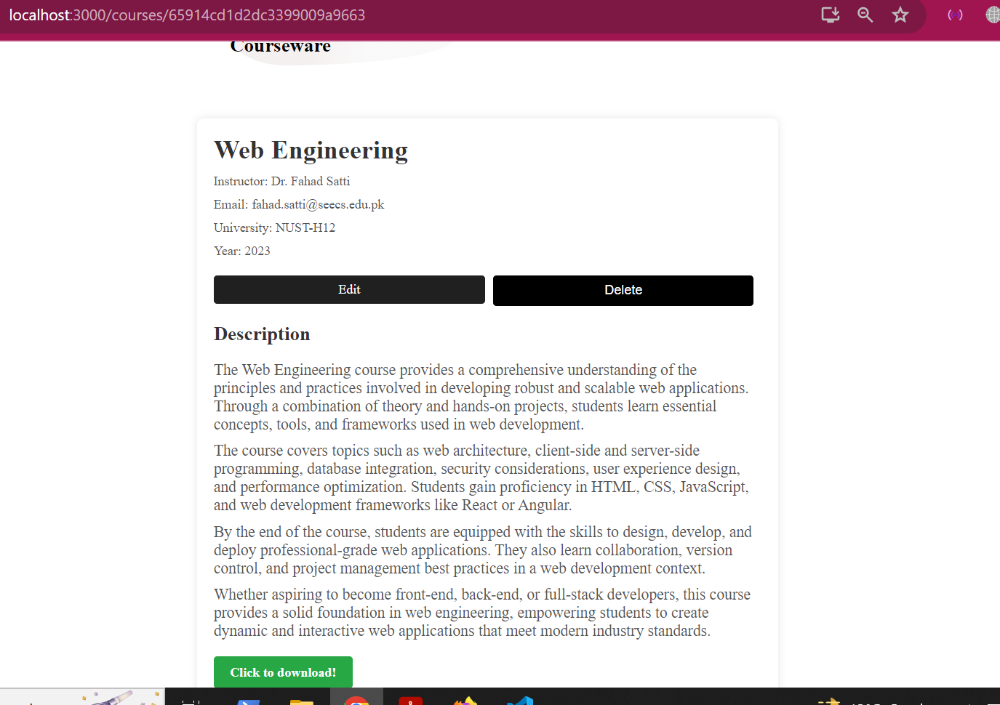
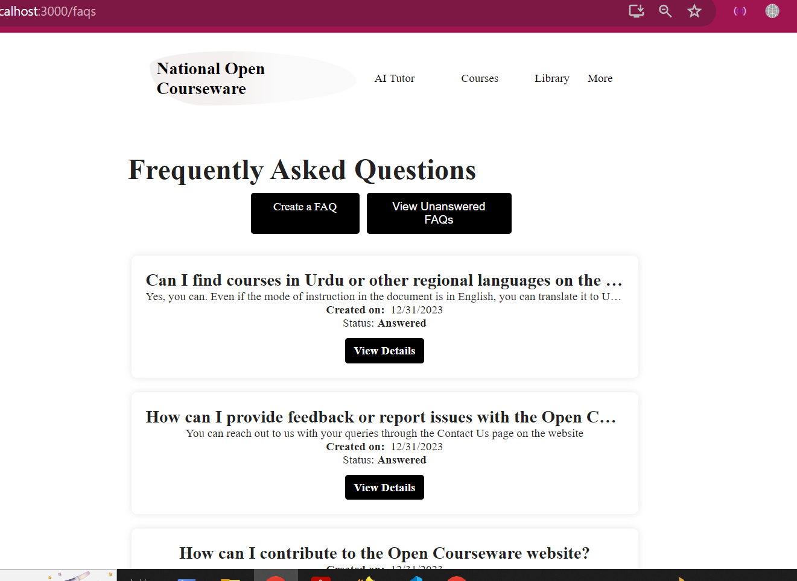

# National Open Courseware

Here is how the UI looks like:

### Landing Page

### Blogs

### Blog details page

### Urdu translation feature in blogs

### Individual course card

### Upload course page

### Library

### AI Tutor

You can upload any pdf, and ask about it from our tutor. We have got you covered!

### Urdu translation feature of AI Tutor response

### Chatrooms

### Inside individual room

### Faqs

